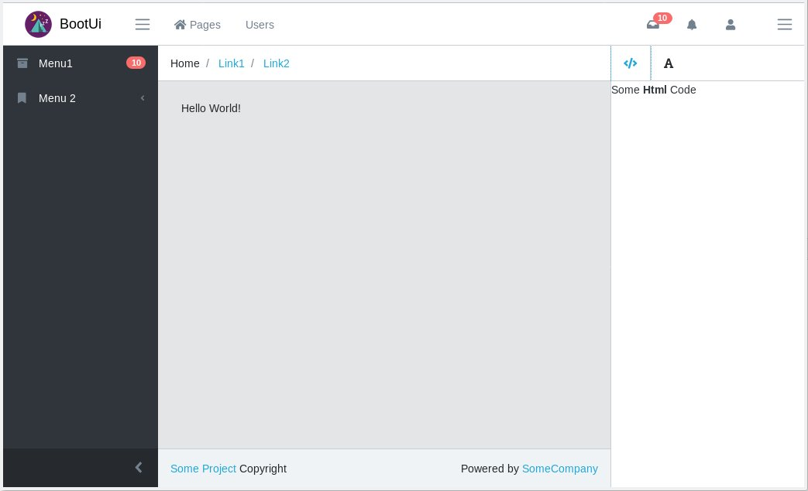

# Phore CoreUI responsive admin theme

- [CoreUI](https://coreui.io/demo/#main.html) 
- [DateRange Picker](http://daterangepicker.com/#examples)

## Full featured Page


```
$config = new CoreUI_Config_PageWithAside();
$tpl = new CoreUI_PageWithAside($config);
$tpl->out();
```


## Login Page


```
$config = new CoreUI_Config_LoginPage();
$tpl = new CoreUI_LoginPage($config);
$tpl->out();
```


## Features

### Daterangepicker

[Homepage](http://www.daterangepicker.com/#config)

**Activate in theme:**
```php
$themeConfig->cssUrls[] = "%assetPath%/daterangepicker.css";
$themeConfig->jsUrls[] = "%assetPath%/daterangepicker.js";
```

**Example**

```javascript
$('#demo').daterangepicker({
    "startDate": "06/12/2020",
    "endDate": "06/18/2020"
}, function(start, end, label) {
  console.log('New date range selected: ' + start.format('YYYY-MM-DD') + ' to ' + end.format('YYYY-MM-DD') + ' (predefined range: ' + label + ')');
});
```

### Select2

[Homepage](https://select2.org/getting-started/basic-usage)

```php
$themeConfig->cssUrls[] = "%assetPath%/select2.min.css";
$themeConfig->jsUrls[] = "%assetPath%/select2.full.min.js";
```

## Develpment

Examples are included when you start the container.